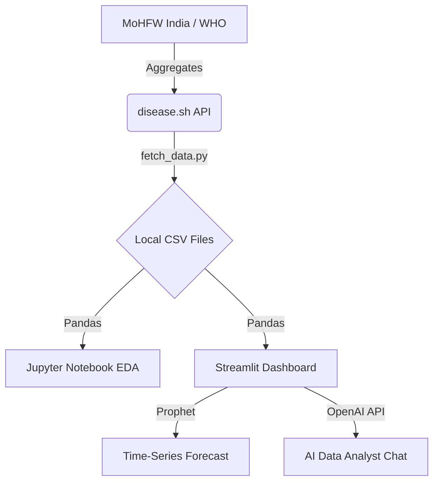

# COVID-19 Global Impact Analysis for India

## Overview
This repository contains a simple but comprehensive analysis of the COVID-19 pandemic's impact in India, aligning with the reporting standards of the World Health Organization (WHO). It examines historical data trends, state-wise recovery and death metrics, and uses time-series forecasting to predict future case patterns.

## Data Sources
- [World Health Organization (WHO) COVID-19 Dashboard](https://covid19.who.int/)
- [disease.sh API](https://disease.sh/) (Aggregated JSON endpoints)
- [Ministry of Health and Family Welfare (MoHFW), India](https://www.mohfw.gov.in/)

## Analysis Components
- **Epidemiological Analysis:** Tracking total cases, deaths, recovery rates, and active cases across all Indian states.
- **Time-Series Forecasting:** Predicting daily new cases for the next 60 days to understand the pandemic's trajectory.
- **State-level Impact:** Breaking down the severity and recovery success rates by individual states.
- **AI Data Analyst (OpenAI Integration):** A feature demonstrating LLM integration where you can chat with the dataset to get AI-generated insights.

## System Architecture (Data Flow)


## Key Findings
- **High Recovery Rate:** The vast majority of infected individuals have successfully recovered, leaving a very small active case count today.
- **State Distribution:** Maharashtra and Kerala recorded the highest total cases historically, but their active cases are now minimal.
- **Forecasting Stability:** The Prophet prediction model shows a flattened curve, indicating that the situation is currently stable with no immediate signs of a new wave.

## Visualizations
This repository includes an interactive web dashboard with various visualizations:
- Interactive pie charts showing the current case distribution
- Area charts tracking historical accumulation of cases
- Stacked bar charts comparing state-wise infection and recovery rates
- Prophet forecast charts with confidence intervals

## Tools & Technologies
- **Data Processing:** Python (Pandas, NumPy, Requests)
- **Visualization:** Matplotlib, Seaborn, Plotly
- **Machine Learning / Forecasting:** Prophet
- **Web App / UI:** Streamlit

## Setup and Usage

### Prerequisites
- Python 3.8+
- Required packages listed in `requirements.txt`

### Installation
```bash
git clone https://github.com/ShubhamPatel/COVID-19_India_Impact_Analysis.git
cd COVID-19_India_Impact_Analysis
pip install -r requirements.txt
```

### Running the Analysis
First, fetch the latest data and generate the local CSV files:
```bash
python fetch_data.py
```
Then, launch the interactive Streamlit dashboard:
```bash
streamlit run app.py
```

## Project Structure
```text
.
├── data/                                      # Generated CSV datasets
├── notebooks/
│   └── COVID19_EDA_and_Forecasting.ipynb      # Jupyter notebook for exploratory analysis
├── app.py                                     # Streamlit dashboard source code
├── fetch_data.py                              # Script to pull data from APIs
├── Project_Report.md                          # Quick text summary of findings
├── requirements.txt                           # Python dependencies
└── README.md                                  # This file
```

## Contributing
Contributions to this analysis are welcome! Please feel free to submit a pull request or open an issue to discuss potential improvements.

1. Fork the repository
2. Create your feature branch (`git checkout -b feature/amazing-analysis`)
3. Commit your changes (`git commit -m 'Add some amazing analysis'`)
4. Push to the branch (`git push origin feature/amazing-analysis`)
5. Open a Pull Request

## License
This project is licensed under the MIT License.

## Contact
**Shubham Patel**
